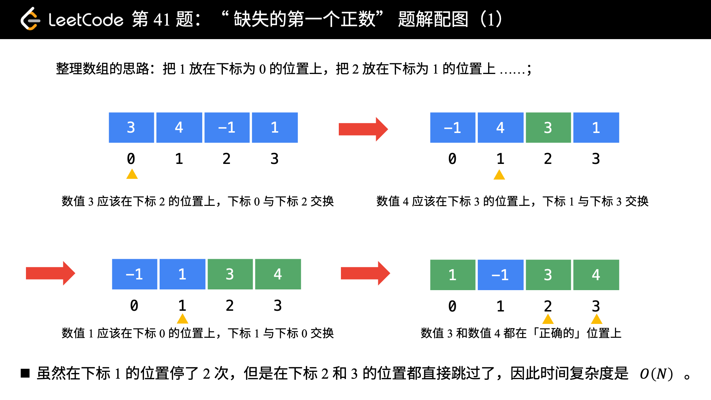

> 2025.2.14

部分代码来自官方题解

## 数组

### [53. 最大子数组和](https://leetcode.cn/problems/maximum-subarray/)

1. 可以把**子数组的元素和转换成两个前缀和的差** -> [121. 买卖股票的最佳时机](https://leetcode.cn/problems/best-time-to-buy-and-sell-stock/) -> 贪心求解
2. 动态规划 -> 注意本题也有两种写法（是否多一个动态规划数组）

```py
    def maxSubArray(self, nums: List[int]) -> int:
        ans = -inf
        min_pre_sum = pre_sum = 0
        for x in nums:
            pre_sum += x  # 当前的前缀和
            ans = max(ans, pre_sum - min_pre_sum)  # 减去前缀和的最小值
            min_pre_sum = min(min_pre_sum, pre_sum)  # 维护前缀和的最小值
        return ans

    def maxSubArray(self, nums: List[int]) -> int:
        ans = -inf  # 注意答案可以是负数，不能初始化成 0
        f = 0
        for x in nums:
            f = max(f, 0) + x
            ans = max(ans, f)
        return ans
```

### [56. 合并区间](https://leetcode.cn/problems/merge-intervals/)

让人不由得想起了线段树...

首先想到的是$O(N^2)$复杂度的简单做法

```py
    def merge(self, intervals: List[List[int]]) -> List[List[int]]:
        def inverve(i1, i2):
            return not (i1[1] < i2[0] or i1[0] > i2[1])
        def mergei(i1, i2):
            return [min(i1[0], i2[0]), max(i1[1], i2[1])]
        ans = []
        worklist = intervals
        while worklist:
            inv1 = worklist.pop()
            interv = False
            for i, inv2 in enumerate(ans):
                if inverve(inv1, inv2):
                    interv = True
                    ans.remove(inv2)
                    worklist.append(mergei(inv1, inv2))
                    break
            if not interv:
                ans.append(inv1)
        return ans
            
```

但其实排序后扫描一遍即可：

```python
    def merge(self, intervals: List[List[int]]) -> List[List[int]]:
        intervals.sort(key=lambda p: p[0])  # 按照左端点从小到大排序
        ans = []
        for p in intervals:
            if ans and p[0] <= ans[-1][1]:  # 可以合并
                ans[-1][1] = max(ans[-1][1], p[1])  # 更新右端点最大值
            else:  # 不相交，无法合并
                ans.append(p)  # 新的合并区间
        return ans
```

### [189. 轮转数组](https://leetcode.cn/problems/rotate-array/)

最简单的思路

```python
    def rotate(self, nums: List[int], k: int) -> None:
        """
        Do not return anything, modify nums in-place instead.
        """
        shift = k % len(nums)
        for i, n in enumerate(nums[-shift:] + nums[0:-shift]):
            nums[i] = n
```

一个神奇的反转做法


```python
    def rotate(self, nums: List[int], k: int) -> None:
        def reverse(i: int, j: int) -> None:
            while i < j:
                nums[i], nums[j] = nums[j], nums[i]
                i += 1
                j -= 1

        n = len(nums)
        k %= n  # 轮转 k 次等于轮转 k%n 次
        reverse(0, n - 1)
        reverse(0, k - 1)
        reverse(k, n - 1)
```

### [238. 除自身以外数组的乘积](https://leetcode.cn/problems/product-of-array-except-self/)

分别计算前缀和后缀product即可

```python
    def productExceptSelf(self, nums: List[int]) -> List[int]:
        preproduct = [1]
        for n in nums[:-1:]:
            preproduct.append(preproduct[-1]*n)

        sufproduct = [1]
        for n in nums[:0:-1]:
            sufproduct.append(bakproduct[-1] * n)
        sufproduct.reverse()

        ans = []
        for i in range(len(nums)):
            ans.append(preproduct[i] * sufproduct[i])
        return ans
```

### [41. 缺失的第一个正数](https://leetcode.cn/problems/first-missing-positive/)

> 给你一个未排序的整数数组 `nums` ，请你找出其中没有出现的最小的正整数。
>
> 请你实现时间复杂度为 `O(n)` 并且只使用常数级别额外空间的解决方案

如果不考虑额外空间，hash一下就好

```python
    def firstMissingPositive(self, nums: List[int]) -> int:
        nums = set(nums)
        i = 1
        while True:
            if not i in nums:
                return i
            i += 1
```

原地哈希： [剑指 Offer 03. 数组中重复的数字](https://leetcode-cn.com/problems/shu-zu-zhong-zhong-fu-de-shu-zi-lcof/)




## 矩阵

### [73. 矩阵置零](https://leetcode.cn/problems/set-matrix-zeroes/)

> 给定一个 `*m* x *n*` 的矩阵，如果一个元素为 **0** ，则将其所在行和列的所有元素都设为 **0** 。请使用 **[原地](http://baike.baidu.com/item/原地算法)** 算法**。**
>
> - 你能想出一个仅使用常量空间的解决方案吗？

首先小的优化

```python
    def setZeroes(self, matrix: List[List[int]]) -> None:
        """
        Do not return anything, modify matrix in-place instead.
        """
        zero_cols = []
        zero_rows = []
        for c in range(len(matrix)):
            for r in range(len(matrix[0])):
                if matrix[c][r] == 0:
                    zero_cols.append(c)
                    zero_rows.append(r)
        for c in zero_cols:
            for i in range(len(matrix[c])):
                matrix[c][i] = 0
        for i in range(len(matrix)):
            for r in zero_rows:
                matrix[i][r] = 0   
```

但依然不是常数...所以有...

> 我们可以用矩阵的第一行和第一列代替方法一中的两个标记数组，以达到 O(1) 的额外空间。但这样会导致原数组的第一行和第一列被修改，无法记录它们是否原本包含 0。因此我们需要额外使用两个标记变量分别记录第一行和第一列是否原本包含 0。

```py
    def setZeroes(self, matrix: List[List[int]]) -> None:
        m, n = len(matrix), len(matrix[0])
        flag_col0 = any(matrix[i][0] == 0 for i in range(m))
        flag_row0 = any(matrix[0][j] == 0 for j in range(n))
        
        for i in range(1, m):
            for j in range(1, n):
                if matrix[i][j] == 0:
                    matrix[i][0] = matrix[0][j] = 0
        
        for i in range(1, m):
            for j in range(1, n):
                if matrix[i][0] == 0 or matrix[0][j] == 0:
                    matrix[i][j] = 0
        
        if flag_col0:
            for i in range(m):
                matrix[i][0] = 0
        
        if flag_row0:
            for j in range(n):
                matrix[0][j] = 0
```


### [54. 螺旋矩阵](https://leetcode.cn/problems/spiral-matrix/)

> 给你一个 `m` 行 `n` 列的矩阵 `matrix` ，请按照 **顺时针螺旋顺序** ，返回矩阵中的所有元素。

经典了，注意边界问题

```python
class Solution:
    def spiralOrder(self, matrix: List[List[int]]) -> List[int]:
        UP, DOWN, LEFT, RIGHT = 1, 2, 3, 4
        MOVE = {UP: (-1, 0), DOWN: (1, 0), LEFT: (0, -1), RIGHT: (0, 1)}
        DIRECT_CHANGE = {RIGHT: DOWN, DOWN: LEFT, LEFT: UP, UP: RIGHT} 
        border = {UP: 0, DOWN: len(matrix) - 1, LEFT: 0, RIGHT: len(matrix[0]) - 1}
        curr = (0, 0)
        direct = RIGHT
        ans = []

        def in_border(pos):
            return border[UP] <= pos[0] <= border[DOWN] and border[LEFT] <= pos[1] <= border[RIGHT]

        def update_border():
            nonlocal border
            if direct == RIGHT:
                border[UP] += 1
            elif direct == DOWN:
                border[RIGHT] -= 1
            elif direct == LEFT:
                border[DOWN] -= 1
            elif direct == UP:
                border[LEFT] += 1

        while True:
            next_pos = (curr[0] + MOVE[direct][0], curr[1] + MOVE[direct][1])
            if in_border(next_pos):
                 ans.append(matrix[curr[0]][curr[1]])
                 curr = next_pos
            else:
                ans.append(matrix[curr[0]][curr[1]])
                update_border()
                direct = DIRECT_CHANGE[direct]
                next_pos = (curr[0] + MOVE[direct][0], curr[1] + MOVE[direct][1])
                if not in_border(next_pos):
                    break
                curr = next_pos

        return ans
```


更简单的做法（一层层向内收缩）：

```python

class Solution:
    def spiralOrder(self, matrix: List[List[int]]) -> List[int]:
        if not matrix or not matrix[0]:
            return []
        rows, cols = len(matrix), len(matrix[0])
        top, bottom, left, right = 0, rows - 1, 0, cols - 1
        ans = []

        while top <= bottom and left <= right:
            # 从左到右遍历顶部行
            for col in range(left, right + 1):
                ans.append(matrix[top][col])
            top += 1

            # 从上到下遍历右侧列
            for row in range(top, bottom + 1):
                ans.append(matrix[row][right])
            right -= 1

            if top <= bottom:
                # 从右到左遍历底部行
                for col in range(right, left - 1, -1):
                    ans.append(matrix[bottom][col])
                bottom -= 1

            if left <= right:
                # 从下到上遍历左侧列
                for row in range(bottom, top - 1, -1):
                    ans.append(matrix[row][left])
                left += 1

        return ans

```


### [48. 旋转图像](https://leetcode.cn/problems/rotate-image/)

> 给定一个 *n* × *n* 的二维矩阵 `matrix` 表示一个图像。请你将图像顺时针旋转 90 度。
>
> 你必须在**[ 原地](https://baike.baidu.com/item/原地算法)** 旋转图像，这意味着你需要直接修改输入的二维矩阵。**请不要** 使用另一个矩阵来旋转图像。

可以先转置，再水平翻转

```python
    def rotate(self, matrix: List[List[int]]) -> None:
        """
        Do not return anything, modify matrix in-place instead.
        """
        for i in range(len(matrix)):
            for j in range(0, i):
                matrix[i][j], matrix[j][i] = matrix[j][i], matrix[i][j]
        for i in range(len(matrix)):
            for j in range(0, len(matrix) // 2):
                l = j
                r = len(matrix) - j - 1
                matrix[i][l], matrix[i][r] = matrix[i][r], matrix[i][l]
                
         	====
            matrix[i].reverse()
           	====
```

### [240. 搜索二维矩阵 II](https://leetcode.cn/problems/search-a-2d-matrix-ii/)

> 编写一个高效的算法来搜索 `*m* x *n*` 矩阵 `matrix` 中的一个目标值 `target` 。该矩阵具有以下特性：
>
> - 每行的元素从左到右升序排列。
> - 每列的元素从上到下升序排列。

最开始四次二分查找即可 -> 思路错误

实际上从右上角看是一颗二分查找树

```python
class Solution:
    def searchMatrix(self, matrix: List[List[int]], target: int) -> bool:
        m, n = len(matrix), len(matrix[0])
        i, j = 0, n - 1  # 从右上角开始
        while i < m and j >= 0:  # 还有剩余元素
            if matrix[i][j] == target:
                return True  # 找到 target
            if matrix[i][j] < target:
                i += 1  # 这一行剩余元素全部小于 target，排除
            else:
                j -= 1  # 这一列剩余元素全部大于 target，排除
        return False
```

## 链表

### [160. 相交链表](https://leetcode.cn/problems/intersection-of-two-linked-lists/)


```py
class Solution:
    def getIntersectionNode(self, headA: ListNode, headB: ListNode) -> Optional[ListNode]:
        p, q = headA, headB
        while p is not q:
            p = p.next if p else headB
            q = q.next if q else headA
        return p

```

### [206. 反转链表](https://leetcode.cn/problems/reverse-linked-list/)

简单的写法：

```python
    def reverseList(self, head: Optional[ListNode]) -> Optional[ListNode]:
        pre = None
        cur = head
        while cur:
            nxt = cur.next
            cur.next = pre
            pre = cur
            cur = nxt
        return pre
```

### [234. 回文链表](https://leetcode.cn/problems/palindrome-linked-list/)

> **进阶：**你能否用 `O(n)` 时间复杂度和 `O(1)` 空间复杂度解决此题？

（否则一个stack就解决了）

这就让人想起来 lc160 题。需要某种构造下的指针移动...

回文链表的性质？-> reverse后依然一样...   中间切开后一边reverse后一样 -> 怎么从中间切开？先统计长度...

但是总感觉太麻烦，怀疑有更简单的做法，一看答案，果然许多机巧（比如中间节点原来可以快慢指针做...）

```python
class Solution:
    # 876. 链表的中间结点
    def middleNode(self, head: Optional[ListNode]) -> Optional[ListNode]:
        slow = fast = head
        while fast and fast.next:
            slow = slow.next
            fast = fast.next.next
        return slow

    # 206. 反转链表
    def reverseList(self, head: Optional[ListNode]) -> Optional[ListNode]:
        pre, cur = None, head
        while cur:
            nxt = cur.next
            cur.next = pre
            pre = cur
            cur = nxt
        return pre

    def isPalindrome(self, head: Optional[ListNode]) -> bool:
        mid = self.middleNode(head)
        head2 = self.reverseList(mid)
        while head2:
            if head.val != head2.val:  # 不是回文链表
                return False
            head = head.next
            head2 = head2.next
        return True
```

### [141. 环形链表  ](https://leetcode.cn/problems/linked-list-cycle/)[142. 环形链表 II](https://leetcode.cn/problems/linked-list-cycle-ii/)

经典的快慢指针了！

141要求返回是否有，142返回相交处

141可以修改链表，因此可以标记已访问节点，不在赘述。

如果同142一样，不可以修改链表，应该怎么做呢？

1. 快慢指针，如果能追上，则有环
2. 如果2倍速度，追上时处于什么状态呢？
   1. 略微推导即可得：追上点到起点长度即为环长的倍数
   2. 此时两个指针，分别从起点和追上点出发，相交处极为入环点！

```python
class Solution:
    def hasCycle(self, head: Optional[ListNode]) -> bool:
        slow = fast = head
        while fast and fast.next:
            slow = slow.next
            fast = fast.next.next
            if fast is slow: 
                return True
        return False 
```

```python
class Solution:
    def detectCycle(self, head: Optional[ListNode]) -> Optional[ListNode]:
        slow = fast = head
        while fast and fast.next:
            slow = slow.next
            fast = fast.next.next
            if fast is slow:
                while slow is not head:
                    slow = slow.next
                    head = head.next
                return slow
        return None
```

### [21. 合并两个有序链表](https://leetcode.cn/problems/merge-two-sorted-lists/) 

1. 注意可以用dummy node简化操作
2. 注意循环终止条件的简化

```python
class Solution:
    def mergeTwoLists(self, list1: Optional[ListNode], list2: Optional[ListNode]) -> Optional[ListNode]:
        cur = dummy = ListNode()  # 用哨兵节点简化代码逻辑
        while list1 and list2:
            if list1.val < list2.val:
                cur.next = list1  # 把 list1 加到新链表中
                list1 = list1.next
            else:  # 注：相等的情况加哪个节点都是可以的
                cur.next = list2  # 把 list2 加到新链表中
                list2 = list2.next
            cur = cur.next
        cur.next = list1 or list2  # 拼接剩余链表
        return dummy.next
```

###  [2. 两数相加](https://leetcode.cn/problems/add-two-numbers/)

```python
class Solution:
    def addTwoNumbers(self, l1: Optional[ListNode], l2: Optional[ListNode]) -> Optional[ListNode]:
        dummy = ListNode()
        cur = dummy
        carry = 0
        while l1 or l2: # 也可把carry判断加在这里
            l1v = l1.val if l1 else 0
            l2v = l2.val if l2 else 0
            psum = carry + l1v + l2v
            cur.next = ListNode(psum % 10)
            carry = psum // 10
            cur = cur.next
            l1 = l1.next if l1 else l1
            l2 = l2.next if l2 else l2
        if carry != 0:
            cur.next = ListNode(1)
        return dummy.next
```


### [19. 删除链表的倒数第 N 个结点](https://leetcode.cn/problems/remove-nth-node-from-end-of-list/)

思路：第一次遍历记录该删哪个节点，然后再删除

可以递归，也可以遍历（好像递归更方便些，退栈时自然是倒序）

```python
    def removeNthFromEnd(self, head: Optional[ListNode], n: int) -> Optional[ListNode]:
        def remove(node):
            if node == None:
                return 0, None
            ith, nxt = remove(node.next)
            node.next = nxt
            if ith + 1 == n:
                return ith + 1, nxt
            else:
                return ith + 1, node
        _, ans = remove(head)
        return ans
```

但其实可以使用前后指针做：

```python
class Solution:
    def removeNthFromEnd(self, head: Optional[ListNode], n: int) -> Optional[ListNode]:
        # 由于可能会删除链表头部，用哨兵节点简化代码
        left = right = dummy = ListNode(next=head)
        for _ in range(n):
            right = right.next  # 右指针先向右走 n 步
        while right.next:
            left = left.next
            right = right.next  # 左右指针一起走
        left.next = left.next.next  # 左指针的下一个节点就是倒数第 n 个节点
        return dummy.next
```


### [24. 两两交换链表中的节点](https://leetcode.cn/problems/swap-nodes-in-pairs/)

初始写法

```python
    def swapPairs(self, head: Optional[ListNode]) -> Optional[ListNode]:
        if not (head and head.next):
            return head
        prev = dummy = ListNode(next=head)
        cur = head
        while cur and cur.next:
            nxt = cur.next
            remain = nxt.next
            prev.next = nxt
            nxt.next = cur
            cur.next = remain
            prev = cur
            cur = remain
        return dummy.next
```

### [25. K 个一组翻转链表](https://leetcode.cn/problems/reverse-nodes-in-k-group/)

首先非常初级的写法：

```python
    def reverseKGroup(self, head: Optional[ListNode], k: int) -> Optional[ListNode]:
        dummy = prev = last = ListNode(next=head)
        
        def reverse(prev, end):
            before = prev
            cur = first = prev.next
            for _ in range(k):
                nxt = cur.next
                cur.next = prev
                prev = cur
                cur = nxt
            first.next = cur
            before.next = end

        for _ in range(k):
            last = last.next
            if last == None:
                return dummy.next
        
        while True:
            last_ = prev.next
            reverse(prev, last)
            last = last_
            for _ in range(k):
                prev = prev.next
                last = last.next
                if last == None:
                     return dummy.next
        return dummy.next
        
```

然后看看SOTA写法：

```python
class Solution:
    def reverseKGroup(self, head: Optional[ListNode], k: int) -> Optional[ListNode]:
        # 统计节点个数
        n = 0
        cur = head
        while cur:
            n += 1
            cur = cur.next

        p0 = dummy = ListNode(next=head)
        pre = None
        cur = head

        # k 个一组处理
        while n >= k:
            n -= k
            for _ in range(k):  # 同 92 题
                nxt = cur.next
                cur.next = pre  # 每次循环只修改一个 next，方便大家理解
                pre = cur
                cur = nxt

            # 见视频
            nxt = p0.next
            nxt.next = cur
            p0.next = pre
            p0 = nxt
        return dummy.next
```

### [138. 随机链表的复制](https://leetcode.cn/problems/copy-list-with-random-pointer/)

首先可以用hashmap

```python
    def copyRandomList(self, head: 'Optional[Node]') -> 'Optional[Node]':
        new_old_mp = {None: None}
        dummy = prev = Node(0)
        ohead = head
        while ohead:
            prev.next = Node(ohead.val)
            prev = prev.next
            new_old_mp[ohead] = prev
            ohead = ohead.next
        while head:
            new_old_mp[head].random = new_old_mp[head.random]
            head = head.next
        return dummy.next
```

也有不用hashmap的神奇做法...


### [148. 排序链表](https://leetcode.cn/problems/sort-list/)

链表只能交换相邻元素，所以只有...冒泡排序？

但是别忘了可以hashmap+数组排序啊！

```python
    def sortList(self, head: Optional[ListNode]) -> Optional[ListNode]:
        if head == None:
            return None
        nums = []
        while head:
            nums.append(head)
            head = head.next
        nums.sort(key=lambda x : x.val, reverse=False)
        dummy = prev = ListNode()
        for n in nums:
            prev.next = n
            prev = n
        nums[-1].next = None
        return dummy.next
```

但其实也可以归并排序

```python
class Solution:
    # 876. 链表的中间结点（快慢指针）
    def middleNode(self, head: Optional[ListNode]) -> Optional[ListNode]:
        slow = fast = head
        while fast and fast.next:
            pre = slow  # 记录 slow 的前一个节点
            slow = slow.next
            fast = fast.next.next
        pre.next = None  # 断开 slow 的前一个节点和 slow 的连接
        return slow

    # 21. 合并两个有序链表（双指针）
    def mergeTwoLists(self, list1: Optional[ListNode], list2: Optional[ListNode]) -> Optional[ListNode]:
        cur = dummy = ListNode()  # 用哨兵节点简化代码逻辑
        while list1 and list2:
            if list1.val < list2.val:
                cur.next = list1  # 把 list1 加到新链表中
                list1 = list1.next
            else:  # 注：相等的情况加哪个节点都是可以的
                cur.next = list2  # 把 list2 加到新链表中
                list2 = list2.next
            cur = cur.next
        cur.next = list1 if list1 else list2  # 拼接剩余链表
        return dummy.next

    def sortList(self, head: Optional[ListNode]) -> Optional[ListNode]:
        # 如果链表为空或者只有一个节点，无需排序
        if head is None or head.next is None:
            return head
        # 找到中间节点，并断开 head2 与其前一个节点的连接
        # 比如 head=[4,2,1,3]，那么 middleNode 调用结束后 head=[4,2] head2=[1,3]
        head2 = self.middleNode(head)
        # 分治
        head = self.sortList(head)
        head2 = self.sortList(head2)
        # 合并
        return self.mergeTwoLists(head, head2)
```


### [23. 合并 K 个升序链表](https://leetcode.cn/problems/merge-k-sorted-lists/)

首先是一个最笨的方法

```python
    def mergeKLists(self, lists: List[Optional[ListNode]]) -> Optional[ListNode]:
        dummy = prev = ListNode()
        while any(lists):
            def maxnode(in1, in2):
                n1 = lists[in1]
                n2 = lists[in2]
                if n1 == None:
                    return in2
                elif n2 == None:
                    return in1
                elif n1.val > n2.val:
                    return in2
                else:
                    return in1
            nxt_idx = reduce(maxnode, range(len(lists)))
            nxt = lists[nxt_idx]
            lists[nxt_idx] = nxt.next
            if nxt.next == None:
                lists.remove(None)
            prev.next = nxt
            prev = nxt
        prev.nxt = None
        return dummy.next
```

然后是最小堆

```python
ListNode.__lt__ = lambda a, b: a.val < b.val  # 让堆可以比较节点大小

class Solution:
    def mergeKLists(self, lists: List[Optional[ListNode]]) -> Optional[ListNode]:
        cur = dummy = ListNode()  # 哨兵节点，作为合并后链表头节点的前一个节点
        h = [head for head in lists if head]  # 初始把所有链表的头节点入堆
        heapify(h)  # 堆化
        while h:  # 循环直到堆为空
            node = heappop(h)  # 剩余节点中的最小节点
            if node.next:  # 下一个节点不为空
                heappush(h, node.next)  # 下一个节点有可能是最小节点，入堆
            cur.next = node  # 合并到新链表中
            cur = cur.next  # 准备合并下一个节点
        return dummy.next  # 哨兵节点的下一个节点就是新链表的头节点
```


### [146. LRU 缓存](https://leetcode.cn/problems/lru-cache/)

基本实现简单，但要求`O(1)`时间复杂度，就有点意思了...

问题在于逐出时，需要逐出距今最远的...

考虑：hashmap+linklist

hashmap o1 查找，linklist o1 移动

实现技巧：抽出子函数

豆包改对的：

```python
class Node:
    def __init__(self, key: int = 0, val: int = 0, nxt: Optional['Node'] = None, pre: Optional['Node'] = None) -> 'Node':
        self.key = key
        self.val = val
        self.nxt = nxt
        self.pre = pre

class LRUCache:

    def __init__(self, capacity: int):
        # 初始化虚拟头节点和尾节点
        self.start = Node()
        self.end = Node()
        self.start.nxt = self.end
        self.end.pre = self.start
        self.map = {}
        self.cap = capacity

    def get(self, key: int) -> int:
        if key in self.map:
            # 若 key 存在，将对应的节点移动到链表尾部
            node = self.map[key]
            self._move_to_end(node)
            return node.val
        return -1

    def put(self, key: int, value: int) -> None:
        if key in self.map:
            # 若 key 已存在，更新节点的值，并将其移动到链表尾部
            node = self.map[key]
            node.val = value
            self._move_to_end(node)
        else:
            if len(self.map) == self.cap:
                # 若缓存已满，删除链表头部的节点
                self._remove_start()
            # 创建新节点并添加到链表尾部
            node = Node(key, value)
            self._add_to_end(node)
            self.map[key] = node

    def _move_to_end(self, node: Node) -> None:
        # 从当前位置移除节点
        self._remove_node(node)
        # 将节点添加到链表尾部
        self._add_to_end(node)

    def _remove_start(self) -> None:
        # 删除链表头部的节点
        node = self.start.nxt
        self._remove_node(node)
        del self.map[node.key]

    def _remove_node(self, node: Node) -> None:
        # 移除指定节点
        node.pre.nxt = node.nxt
        node.nxt.pre = node.pre

    def _add_to_end(self, node: Node) -> None:
        # 将节点添加到链表尾部
        node.pre = self.end.pre
        node.nxt = self.end
        self.end.pre.nxt = node
        self.end.pre = node
```


更好的版本：

```python
class Node:
    # 提高访问属性的速度，并节省内存
    __slots__ = 'prev', 'next', 'key', 'value'

    def __init__(self, key=0, value=0):
        self.key = key
        self.value = value

class LRUCache:
    def __init__(self, capacity: int):
        self.capacity = capacity
        self.dummy = Node()  # 哨兵节点
        self.dummy.prev = self.dummy
        self.dummy.next = self.dummy
        self.key_to_node = dict()

    # 获取 key 对应的节点，同时把该节点移到链表头部
    def get_node(self, key: int) -> Optional[Node]:
        if key not in self.key_to_node:  # 没有这本书
            return None
        node = self.key_to_node[key]  # 有这本书
        self.remove(node)  # 把这本书抽出来
        self.push_front(node)  # 放在最上面
        return node

    def get(self, key: int) -> int:
        node = self.get_node(key)
        return node.value if node else -1

    def put(self, key: int, value: int) -> None:
        node = self.get_node(key)
        if node:  # 有这本书
            node.value = value  # 更新 value
            return
        self.key_to_node[key] = node = Node(key, value)  # 新书
        self.push_front(node)  # 放在最上面
        if len(self.key_to_node) > self.capacity:  # 书太多了
            back_node = self.dummy.prev
            del self.key_to_node[back_node.key]
            self.remove(back_node)  # 去掉最后一本书

    # 删除一个节点（抽出一本书）
    def remove(self, x: Node) -> None:
        x.prev.next = x.next
        x.next.prev = x.prev

    # 在链表头添加一个节点（把一本书放在最上面）
    def push_front(self, x: Node) -> None:
        x.prev = self.dummy
        x.next = self.dummy.next
        x.prev.next = x
        x.next.prev = x
```

