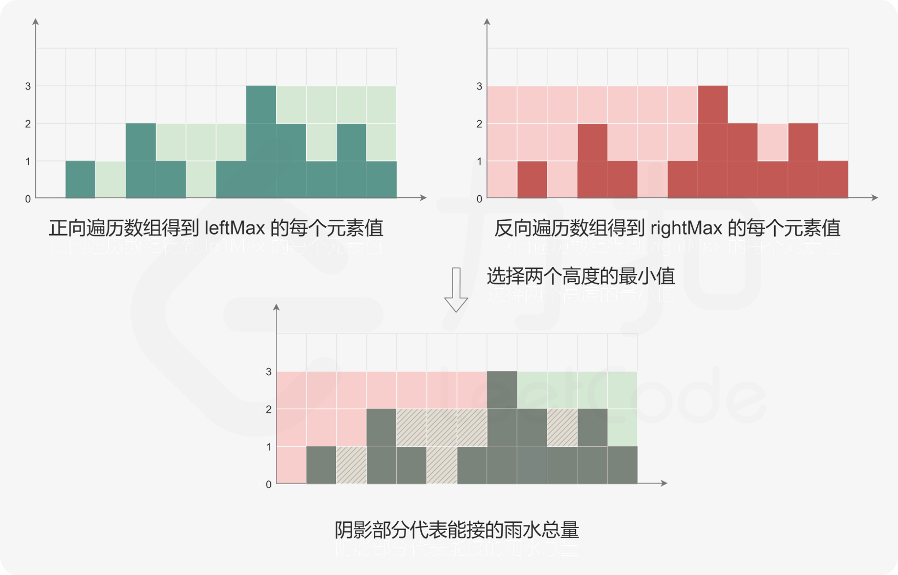
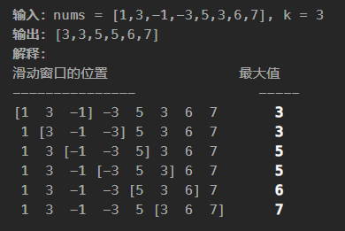

> 2024.11.22

部分代码来自官方题解

## 哈希

### [1. 两数之和](https://leetcode.cn/problems/two-sum/)

暴力做法：`O(n^2)` 两重循环遍历所有组合

优化：

考虑内层循环只是为了寻找某个确定指 `target - num[i]`

可以把两层循环的遍历方向统一，再把第二层循环的遍历用哈希查表替代（第一次循环时已**收集了所有信息**）

### [49. 字母异位词分组](https://leetcode.cn/problems/group-anagrams/)

1. 如何判断异位词？ -> 排序（或者字母计数）
2. 如何分组? -> 遍历，对 key 哈希得到分组

```python
class Solution:
    def groupAnagrams(self, strs: List[str]) -> List[List[str]]:
        mp = collections.defaultdict(list)

        for st in strs:
            key = "".join(sorted(st))
            mp[key].append(st)
        
        return list(mp.values())

class Solution:
    def groupAnagrams(self, strs: List[str]) -> List[List[str]]:
        mp = collections.defaultdict(list)

        for st in strs:
            counts = [0] * 26
            for ch in st:
                counts[ord(ch) - ord("a")] += 1
            # 需要将 list 转换成 tuple 才能进行哈希
            mp[tuple(counts)].append(st)
        
        return list(mp.values())
```

### [128. 最长连续序列](https://leetcode.cn/problems/longest-consecutive-sequence/)

> 给定一个未排序的整数数组 `nums` ，找出数字连续的最长序列（不要求序列元素在原数组中连续）的长度。

也就是穿针引线能达到的最长长度

[最初思路](https://x.com/zhao_yongzhen/status/1858168899751330178)：

**只考虑**数组的一个子区间，能否求出这个子区间的最长序列呢？

考虑其中数组中任意一个数 `n`，与他相邻的数肯定为 `n+1` `n-1`

如果在**扩展**区间时有一个大哈希表，key 为区间端点，value 为该**区间长度**（可以不用记录端点下标！）

每次扩展一个数时，就能知道是否可以加入已有区间链中了

```python

class Solution(object):
    def longestConsecutive(self, nums):
        hash_dict = dict()
        
        max_length = 0
        for num in nums:
            if num not in hash_dict:
                left = hash_dict.get(num - 1, 0)
                right = hash_dict.get(num + 1, 0)
                
                cur_length = 1 + left + right
                if cur_length > max_length:
                    max_length = cur_length
                
                hash_dict[num] = cur_length
                hash_dict[num - left] = cur_length
                hash_dict[num + right] = cur_length
                
        return max_length
```

但**如果**能由 `n` 知道 `n-1`，**自然也**能知道 `n-2` ...

所以手动对每个可能的区间穿针引线即可！

```python
class Solution:
    def longestConsecutive(self, nums: List[int]) -> int:
        longest_streak = 0
        num_set = set(nums)

        for num in num_set:
            if num - 1 not in num_set:
                current_num = num
                current_streak = 1

                while current_num + 1 in num_set:
                    current_num += 1
                    current_streak += 1

                longest_streak = max(longest_streak, current_streak)

        return longest_streak
```

## 双指针

### [283. 移动零](https://leetcode.cn/problems/move-zeroes/)

> 给定一个数组 `nums`，编写一个函数将所有 `0` 移动到数组的末尾，同时保持非零元素的相对顺序。

第一个想法：冒泡排序

但是冒泡时也有很多**多余动作**

实际上双指针，一个指针**维持性质**（与冒泡排序相同）

但为了维持性质变化数组时，不用像冒泡一样挨个比较，而是直接选择一个非0的交换（使用另外一个指针即可）

因此是 双指针

```python
class Solution:
    def moveZeroes(self, nums: List[int]) -> None:
        n = len(nums)
        left = right = 0
        while right < n:
            if nums[right] != 0:
                nums[left], nums[right] = nums[right], nums[left]
                left += 1
            right += 1
```

### [11. 盛最多水的容器](https://leetcode.cn/problems/container-with-most-water/)


暴力解法：枚举所有可能容量组合 `O(n^2)`

优化：考虑哪里有**冗余计算**？-> 如果宽度和高度同时减小，容量不可能最大。而且高度取决于最低墙。

考虑一种没有冗余的**遍历顺序**。

考虑到目标是求极值。我们的顺序最好能避免**明显的递减**

考虑宽度从大到小遍历，则每次减小宽度都要增加高度...

所以双指针即可，每次移动指向较低墙的指针 `O(n)`

```python
class Solution:
    def maxArea(self, height: List[int]) -> int:
        l, r = 0, len(height) - 1
        ans = 0
        while l < r:
            area = min(height[l], height[r]) * (r - l)
            ans = max(ans, area)
            if height[l] <= height[r]:
                l += 1
            else:
                r -= 1
        return ans

```

### [15. 三数之和](https://leetcode.cn/problems/3sum/)

> 给你一个整数数组 `nums` ，判断是否存在三元组 `[nums[i], nums[j], nums[k]]` 满足 `i != j`、`i != k` 且 `j != k` ，同时还满足 `nums[i] + nums[j] + nums[k] == 0` 。请你返回所有和为 `0` 且不重复的三元组。

1. 考虑如果固定一个数，就成了「两数之和」问题。`O(n^2)`
   1. 此时的两重遍历顺序如果再一致化？ -> 但也没办法知道第三个数是什么...
2. 考虑到三数之和一定为 0，同时还有 **不重复** 的要求
3. 不重复 -> 排序，然后内层循环用双指针（还是简化遍历）
   1. 为什么「两数之和」不用双指针？-> 排序耗时太长

```python
class Solution:
    def threeSum(self, nums: List[int]) -> List[List[int]]:
        n = len(nums)
        nums.sort()
        ans = list()
        
        # 枚举 a
        for first in range(n):
            # 需要和上一次枚举的数不相同
            if first > 0 and nums[first] == nums[first - 1]:
                continue
            # c 对应的指针初始指向数组的最右端
            third = n - 1
            target = -nums[first]
            # 枚举 b
            for second in range(first + 1, n):
                # 需要和上一次枚举的数不相同
                if second > first + 1 and nums[second] == nums[second - 1]:
                    continue
                # 需要保证 b 的指针在 c 的指针的左侧
                while second < third and nums[second] + nums[third] > target:
                    third -= 1
                # 如果指针重合，随着 b 后续的增加
                # 就不会有满足 a+b+c=0 并且 b<c 的 c 了，可以退出循环
                if second == third:
                    break
                if nums[second] + nums[third] == target:
                    ans.append([nums[first], nums[second], nums[third]])
        
        return ans
```

### [42. 接雨水](https://leetcode.cn/problems/trapping-rain-water/)


1. 暴力思路显然超时（每一层分别遍历）
2. 考虑：
   1. 什么时候能接到雨水 -> 凹形	
   2. 什么是凹 -> 两侧墙中较矮侧为单侧极值（从此望去，一马平川

所以



```python
class Solution:
    def trap(self, height: List[int]) -> int:
        if not height:
            return 0
        
        n = len(height)
        leftMax = [height[0]] + [0] * (n - 1)
        for i in range(1, n):
            leftMax[i] = max(leftMax[i - 1], height[i])

        rightMax = [0] * (n - 1) + [height[n - 1]]
        for i in range(n - 2, -1, -1):
            rightMax[i] = max(rightMax[i + 1], height[i])

        ans = sum(min(leftMax[i], rightMax[i]) - height[i] for i in range(n))
        return ans
```


## 滑动窗口

### [3. 无重复字符的最长子串](https://leetcode.cn/problems/longest-substring-without-repeating-characters/)

> 给定一个字符串 `s` ，请你找出其中不含有重复字符的 最长 子串 的长度。

滑动窗口，有重复的就收缩（避免遍历含有重复字符的子串

```python
class Solution:
    def lengthOfLongestSubstring(self, s: str) -> int:
        l = 0
        res = 0
        cs = set()
        for i, c in enumerate(s):
            if c in cs:
                while c in cs:
                    cs.remove(s[l])
                    l += 1
            cs.add(c)
            res = max(res, i - l + 1)
        return res

```

### [438. 找到字符串中所有字母异位词](https://leetcode.cn/problems/find-all-anagrams-in-a-string/)

> 给定两个字符串 `s` 和 `p`，找到 `s` 中所有 `p` 的 异位词的子串，返回这些子串的起始索引。不考虑答案输出的顺序。

简单暴力做法：`O(nlogn + nmlogm)`

```python
class Solution:
    def findAnagrams(self, s: str, p: str) -> List[int]:
        res = []
        ss = sorted(p)
        for i in range(0, len(s) - len(p) + 1):
            sub = s[i: i + len(p)]
            if sorted(sub) == ss:
                res.append(i)
        return res 
            
```

但考虑滑动窗口，渐变计算 ·`O(m+(n−m)Σ)`

```python
class Solution:
    def findAnagrams(self, s: str, p: str) -> List[int]:
        s_len, p_len = len(s), len(p)
        
        if s_len < p_len:
            return []

        ans = []
        s_count = [0] * 26
        p_count = [0] * 26
        for i in range(p_len):
            s_count[ord(s[i]) - 97] += 1
            p_count[ord(p[i]) - 97] += 1

        if s_count == p_count:
            ans.append(0)

        for i in range(s_len - p_len):
            s_count[ord(s[i]) - 97] -= 1
            s_count[ord(s[i + p_len]) - 97] += 1
            
            if s_count == p_count:
                ans.append(i + 1)

        return ans
```

## 子串

### [560. 和为 K 的子数组](https://leetcode.cn/problems/subarray-sum-equals-k/)

> 给你一个整数数组 `nums` 和一个整数 `k` ，请你统计并返回 *该数组中和为 `k` 的子数组的个数* 。

暴力解法：`O(n^2)`

但是考虑... `sum(a...b) = sum(0... b) - sum(0... a) = k`

把每个数`a`改为 `sum(0... a)`，这不就成了「两数之和」吗？

**漂亮的问题转化**

```python
from collections import defaultdict
class Solution:
    def subarraySum(self, nums: List[int], k: int) -> int:
        mp = defaultdict(int)
        mp[0] = 1
        prsum = 0
        res = 0
        for n in nums:
            prsum += n
            res += mp[prsum - k]
            mp[prsum] += 1
        return res 
```


### [239. 滑动窗口最大值](https://leetcode.cn/problems/sliding-window-maximum/)



一开始思路：

有没有这样一种数据结构：增删都快，而且能求最值？`O(nlogn)`

当然有，但前提是你知道 api 

> 可以将自定义元素和一个可比较的键（如数字）组合成元组，然后将元组添加到堆中。`heapq` 模块会首先比较元组的第一个元素。
>
> 或者 可以在自定义类中实现 `__lt__`（小于）方法，`heapq` 模块会使用这个方法来进行元素之间的比较。

```python
class Solution:
    def maxSlidingWindow(self, nums: List[int], k: int) -> List[int]:
        n = len(nums)
        # 注意 Python 默认的优先队列是小根堆
        q = [(-nums[i], i) for i in range(k)]
        heapq.heapify(q)

        ans = [-q[0][0]]
        for i in range(k, n):
            heapq.heappush(q, (-nums[i], i))
            while q[0][1] <= i - k:
                heapq.heappop(q)
            ans.append(-q[0][0])
        
        return ans

```

`O(n)` 的优化？你没看错...

> 由于我们需要求出的是滑动窗口的最大值，如果当前的滑动窗口中有两个下标 i 和 j，其中 i 在 j 的左侧（i<j），并且 i 对应的元素不大于 j 对应的元素（nums[i]≤nums[j]），那么会发生什么呢？
>
> 当滑动窗口向右移动时，只要 i 还在窗口中，那么 j 一定也还在窗口中，这是 i 在 j 的左侧所保证的。因此，由于 nums[j] 的存在，nums[i] 一定不会是滑动窗口中的最大值了，我们可以将 nums[i] 永久地移除。

(**深入滑动过程内部**

即维护了顺序，也维护了极值，妙哉（关键在意识到：不是极值的可以早早丢掉，而不是等滑过后再丢

```python
class Solution:
    def maxSlidingWindow(self, nums: List[int], k: int) -> List[int]:
        n = len(nums)
        q = collections.deque()
        for i in range(k):
            while q and nums[i] >= nums[q[-1]]:
                q.pop()
            q.append(i)
        # 填充初始窗口

        ans = [nums[q[0]]]
        for i in range(k, n):
            while q and nums[i] >= nums[q[-1]]:
                q.pop()
            q.append(i)
            while q[0] <= i - k:
                q.popleft()
            ans.append(nums[q[0]])
        
        return ans
```

### [76. 最小覆盖子串](https://leetcode.cn/problems/minimum-window-substring/)

> 给你一个字符串 `s` 、一个字符串 `t` 。返回 `s` 中涵盖 `t` 所有字符的最小子串。如果 `s` 中不存在涵盖 `t` 所有字符的子串，则返回空字符串 `""` 。

一开始就意识到，典型的滑动窗口

但关键在于选择怎样的数据结构**维护当前窗口信息**

(如果用原生 dict，的确过于繁琐...

```python
class Solution:
    def minWindow(self, s: str, t: str) -> str:
        ans_left, ans_right = -1, len(s)
        cnt_s = Counter()  # s 子串字母的出现次数
        cnt_t = Counter(t)  # t 中字母的出现次数

        left = 0
        for right, c in enumerate(s):  # 移动子串右端点
            cnt_s[c] += 1  # 右端点字母移入子串
            while cnt_s >= cnt_t:  # 涵盖
                if right - left < ans_right - ans_left:  # 找到更短的子串
                    ans_left, ans_right = left, right  # 记录此时的左右端点
                cnt_s[s[left]] -= 1  # 左端点字母移出子串
                left += 1
        return "" if ans_left < 0 else s[ans_left: ans_right + 1]
```

