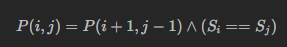

> 2024.12.1

# 动态规划基本知识

有趣的方法：

+ [`10^7` 计算为 1s](https://www.desgard.com/algo/docs/part1/ch01/1-time-complexity/)

相关资料

1. [算法通关手册](https://algo.itcharge.cn/10.Dynamic-Programming/)
2. [ntnu](https://web.ntnu.edu.tw/~algo/DynamicProgramming.html)
3. [hello算法](https://www.hello-algo.com/chapter_dynamic_programming/)
4. [oi wiki](https://oi-wiki.org/dp/)

dynamic programming
= divide-and-conquer method + memoization

```
1. 把原問題遞迴分割成許多更小的問題。（recurrence）
   1-1. 子問題與原問題的求解方式皆類似。（optimal sub-structure）
   1-2. 子問題會一而再、再而三的出現。（overlapping sub-problems）
2. 設計計算過程：
   2-1. 確認每個問題需要哪些子問題來計算答案。（recurrence）
   2-2. 確認總共有哪些問題。（state space）
   2-3. 把問題一一對應到表格。（lookup table）
   2-4. 決定問題的計算順序。（computational sequence）
   2-5. 確認初始值、計算範圍。（initial states / boundary）
3. 實作，主要有兩種方式：
   3-1. top-down
   3-2. bottom-up
```

> 為什麼分割問題之後，就容易計算答案呢？因為分割問題時，同時也分類了這個問題的所有可能答案。分類使得答案的規律變得單純，於是更容易求得答案。

# Leetcode 题目

## 动态规划

### [70. 爬楼梯](https://leetcode.cn/problems/climbing-stairs/)

> 假设你正在爬楼梯。需要 `n` 阶你才能到达楼顶。
>
> 每次你可以爬 `1` 或 `2` 个台阶。你有多少种不同的方法可以爬到楼顶呢？

计数问题，递归分解。考虑依赖关系，每次只保存两个状态即可。时间复杂度`O(n)`

```python
class Solution:
    def climbStairs(self, n: int) -> int:
        if n == 1:
            return 1
        a = 1
        b = 2
        for _ in range(n - 2):
            c = b + a
            a = b
            b = c
        return b 
```

考虑到递推式齐次线性的，则可以转化为矩阵乘法，进而使用[快速幂算法](https://www.desgard.com/algo/docs/part2/ch01/3-matrix-quick-pow/)把复杂度降到 `O(log n)` (非齐次式也可以通过变换转化为齐次递推问题)

快速幂思路：

也可以直接求出[通项公式](https://www.cnblogs.com/Lonely923/p/17121378.html)

### [118. 杨辉三角](https://leetcode.cn/problems/pascals-triangle/)

```python
class Solution:
    def generate(self, numRows: int) -> List[List[int]]:
        res = []
        for i in range(numRows):
            row = []
            for j in range(i + 1):
                if j == 0 or j == i:
                    row.append(1)
                else:
                    row.append(res[-1][j - 1] + res[-1][j])
            res.append(row)
        return res
```

### [198. 打家劫舍](https://leetcode.cn/problems/house-robber/)

> 你是一个专业的小偷，计划偷窃沿街的房屋。每间房内都藏有一定的现金，影响你偷窃的唯一制约因素就是相邻的房屋装有相互连通的防盗系统，**如果两间相邻的房屋在同一晚上被小偷闯入，系统会自动报警**。
>
> 给定一个代表每个房屋存放金额的非负整数数组，计算你 **不触动警报装置的情况下** ，一夜之内能够偷窃到的最高金额。

递推关系：偷前 N 家所得最大金额 = max(他的金额 + 前 N-2 家金额，前 N-1家金额)

通过偷第N家与否划分子问题

```python
class Solution:
    def rob(self, nums: List[int]) -> int:
        first = 0
        second = 0
        for i in nums:
            first, second = second, first + i
            second = max(first, second)
        return second
```

技巧：

1. 再左侧多加两家钱为0的房屋，不影响结果且简化计算
2. python中可以并行赋值

> 我的旧解法为：
>
> ```python
> class Solution:
>     def rob(self, nums: List[int]) -> int:
>         mh = 0 # with
>         mt = 0 # without
>         for i in nums:
>             nmt = mh
>             nmh = mt + i
>             mt = nmt
>             mh = max(nmt, nmh)
>         return mh
> ```
>
> 该解法中，子问题间递推关系不如新解法清晰

### [279. 完全平方数](https://leetcode.cn/problems/perfect-squares/)

> 给你一个整数 `n` ，返回 *和为 `n` 的完全平方数的最少数量* 。

本题实际上是找硬币的变体

但“硬币面额”需要根据n推断，所以时间复杂度 `O(n sqrt n)`

```python
class Solution:
    def numSquares(self, n: int) -> int:
        dp = [0]*(n+1)
        for i in range(1, n + 1):
            if i ** 0.5 % 1 == 0:
                dp[i] = 1
            else:
                dp[i] = 1+min([dp[i-j*j] for j in range(1,int(i**0.5)+1)])
        return dp[-1]
```

### [322. 零钱兑换](https://leetcode.cn/problems/coin-change/)

经典找硬币

```python
class Solution:
    def coinChange(self, coins: List[int], amount: int) -> int:
        dp = [0] * (amount + 1)
        dp[0] = 0
        for i in range(1, amount + 1):
            inds = [dp[i - coin] for coin in coins if coin <= i and dp[i - coin] != -1]
            if inds == []:
                dp[i] = -1
            else:
                dp[i] = min(inds) + 1
        return dp[-1]
```

### [139. 单词拆分](https://leetcode.cn/problems/word-break/)

> 给你一个字符串 `s` 和一个字符串列表 `wordDict` 作为字典。如果可以利用字典中出现的一个或多个单词拼接出 `s` 则返回 `true`。
>
> **注意：**不要求字典中出现的单词全部都使用，并且字典中的单词可以重复使用。

1. 首先考虑 这也是一个找硬币问题

```python
class Solution:
    def wordBreak(self, s: str, wordDict: List[str]) -> bool:
        @cache
        def dfs(s: str) -> bool:
            if all(c == '_' for c in s):
                return True
            words = [word for word in wordDict if word in s]
            if words == []:
                return False
            else:
                return any([dfs(s.replace(word, "_", 1)) for word in words])    
        return dfs(s)
```

但是超时。

考虑到字符串最后一部分一定是一个单词，进行优化。时间复杂度 `O(n^2)`

```python
class Solution:
    def wordBreak(self, s: str, wordDict: List[str]) -> bool:
        max_len = max(map(len, wordDict))  # 用于限制下面 j 的循环次数
        words = set(wordDict)  # 便于快速判断 s[j:i] in words

        @cache  # 缓存装饰器，避免重复计算 dfs 的结果（记忆化）
        def dfs(i: int) -> bool:
            if i == 0:  # 成功拆分！
                return True
            return any(s[j:i] in words and dfs(j)
                       for j in range(i - 1, max(i - max_len - 1, -1), -1))

        return dfs(len(s))
```

### [300. 最长递增子序列](https://leetcode.cn/problems/longest-increasing-subsequence/)

> 给你一个整数数组 `nums` ，找到其中最长严格递增子序列的长度。

依然考虑安装数组长度递归，需要保存最长长度和当前最大值。怎么持有最大值，此时我按之前的 with/without 递归思路来做的

```python
class Solution:
    def lengthOfLIS(self, nums: List[int]) -> int:
        dp1 = [0] * len(nums) # with
        dp2 = [0] * len(nums) # all
        dp1[0] = 1
        dp2[0] = 1
        for i in range(1, len(nums)):
            prev = 0
            for j in range(0, i):
                if nums[j] < nums[i]:
                    prev = max(dp1[j], prev)
            dp1[i] = prev + 1
            dp2[i] = max(dp2[i - 1], dp1[i])
        return dp2[-1]
```

事实上，问题可以进一步转换，先求包含最后一个数的最大值，再max一下

```python
class Solution:
    def lengthOfLIS(self, nums: List[int]) -> int:
        if not nums:
            return 0
        dp = []
        for i in range(len(nums)):
            dp.append(1)
            for j in range(i):
                if nums[i] > nums[j]:
                    dp[i] = max(dp[i], dp[j] + 1)
        return max(dp)
```

但是也有一个贪心做法：使得每次加上的数尽可能小...` O(n log n)`

不过一开始并没有想到贪心策略...

### [152. 乘积最大子数组](https://leetcode.cn/problems/maximum-product-subarray/)

> 给你一个整数数组 `nums` ，请你找出数组中乘积最大的非空连续 子数组
>
> （该子数组中至少包含一个数字），并返回该子数组所对应的乘积。

因为含有负数，所以乘积缺乏单调性，难以划分子问题。一开始似乎只有 `O(n^2)`的暴力做法。

但是细细考虑，乘法结果的符号虽然变化，但数值却一直增大。如果同时求最大值和最小值，就有办法用动态规划了。

```python
class Solution:
    def maxProduct(self, nums: List[int]) -> int:
        ans = -inf  # 注意答案可能是负数
        f_max = f_min = 1
        for x in nums:
            f_max, f_min = max(f_max * x, f_min * x, x), \
                           min(f_max * x, f_min * x, x)
            ans = max(ans, f_max)
        return ans
```

这里也注意：动态规划不一定要直接求出最终结果，可以只作为一个子程序

### [416. 分割等和子集](https://leetcode.cn/problems/partition-equal-subset-sum/)

> 给你一个 **只包含正整数** 的 **非空** 数组 `nums` 。请你判断是否可以将这个数组分割成两个子集，使得两个子集的元素和相等。

问题转换：是否存在一个子集，和为 sum / 2。

01背包问题，**同时对数组长度和总和递归**

```python
class Solution:
    def canPartition(self, nums: List[int]) -> bool:
        # 1. 转化问题
        # 2. 01背包
        @cache
        def dfs(i: int, j: int) -> bool:
            if i < 0:
                return j == 0
            return j >= nums[i] and dfs(i - 1, j - nums[i]) or dfs(i - 1, j)

        s = sum(nums)
        return s % 2 == 0 and dfs(len(nums) - 1, s // 2)
```

### [32. 最长有效括号](https://leetcode.cn/problems/longest-valid-parentheses/)

> 给你一个只包含 `'('` 和 `')'` 的字符串，找出最长有效（格式正确且连续）括号子串的长度。

括号匹配就可以。每次有匹配到的，则更新长度。

```python
class Solution:
    def longestValidParentheses(self, s: str) -> int:
        res = 0
        stk = []
        for i in range(0, len(s)):
            if s[i] == '(':
                stk.append(i + 1)
            else:
                if len(stk) != 0 and stk[-1] > 0:
                    stk.pop()
                    if len(stk) == 0:
                        length = i + 1
                    else:
                        length = i - abs(stk[-1]) + 1
                    res = max(res, length)
                else:
                    stk.append(-(i + 1))
        return res

```

## 多维动态规划

### [62. 不同路径](https://leetcode.cn/problems/unique-paths/)


经典递推

```python
class Solution:
    def uniquePaths(self, m: int, n: int) -> int:
        dp = [[0] * m] * n
        for i in range(0, n):
            dp[i][0] = 1
        for i in range(0, m):
            dp[0][i] = 1
        for i in range(1, n):
            for j in range(1, m):
                dp[i][j] = dp[i][j - 1] + dp[i - 1][j]
        return dp[n - 1][m - 1]
```

### [64. 最小路径和](https://leetcode.cn/problems/minimum-path-sum/)


```python
class Solution:
    def minPathSum(self, grid: List[List[int]]) -> int:
        c = len(grid)
        r = len(grid[0])
        # dp = [[0] * r] * c  # shallow copy!!!
        dp = [[0] * r for _ in range(c)]
        dp[0][0] = grid[0][0]
        for i in range(1, c):
            dp[i][0] = dp[i-1][0] + grid[i][0]
        for i in range(1, r):
            dp[0][i] = dp[0][i-1] + grid[0][i]
        for i in range(1, c):
            for j in range(1, r):
                dp[i][j] = min(dp[i - 1][j], dp[i][j - 1]) + grid[i][j]
        return dp[c - 1][r - 1]
```

### [5. 最长回文子串](https://leetcode.cn/problems/longest-palindromic-substring/)

> 给你一个字符串 `s`，找到 `s` 中最长的 回文子串。

思路：从kernel开始拓展

```python
class Solution:
    def longestPalindrome(self, s: str) -> str:
        maxl = 1
        start = 0
        # one kernel
        for i in range(len(s)):
            for j in range(1, min(i + 1, len(s) - i)):
                if s[i + j] == s[i - j]:
                    if 1 + 2 * j > maxl:
                        start = i - j
                        maxl = 1 + 2 * j
                else:
                    break
                    

        # two kernel
        for i in range(len(s) - 1):
            if s[i] == s[i + 1]:
                if 2 > maxl:
                    start = i
                    maxl = 2
                for j in range(1, min(i+1, len(s)-i-1)):
                    if s[i + j + 1] == s[i - j]:
                        if 2 + 2 * j > maxl:
                            start = i - j
                            maxl = 2 + 2 * j
                    else:
                        break
        return s[start:start + maxl]
```

但其实也可以动态规划：



### [1143. 最长公共子序列](https://leetcode.cn/problems/longest-common-subsequence/)

同时对两个序列的长度做递归...

```python
class Solution:
    # 下标运算好复杂
    def longestCommonSubsequence(self, text1: str, text2: str) -> int:
        if set(text1).isdisjoint(set(text2)):
            return 0
        dp = [[0 for _ in range(len(text1))] for _ in range(len(text2))] 
        for i in range(len(text2)):
            dp[i][0] = 1 if text2[i] == text1[0] else 0
        for i in range(len(text1)):
            dp[0][i] = 1 if text2[0] == text1[i] else 0
        for i in range(len(text2)):
            for j in range(len(text1)):
                c = text2[i] 
                l = 0
                for k in reversed(range(0, j + 1)):
                    if k == 0 or i == 0:
                        prev = 0
                    else:
                        prev = dp[i-1][k-1]
                    if text1[k] == c:
                        l = prev + 1
                        break
                dp[i][j] = max(l, dp[i-1][j])
        return dp[-1][-1]
```

官方题解：

```python
class Solution:
    def longestCommonSubsequence(self, text1: str, text2: str) -> int:
        m, n = len(text1), len(text2)
        dp = [[0] * (n + 1) for _ in range(m + 1)]
        
        for i in range(1, m + 1):
            for j in range(1, n + 1):
                if text1[i - 1] == text2[j - 1]:
                    dp[i][j] = dp[i - 1][j - 1] + 1
                else:
                    dp[i][j] = max(dp[i - 1][j], dp[i][j - 1])
        
        return dp[m][n]
```

### [72. 编辑距离](https://leetcode.cn/problems/edit-distance/)

经典问题

```python
class Solution:
    def minDistance(self, word1: str, word2: str) -> int:
        if len(word1) == 0 or len(word2) == 0:
            return max(len(word1), len(word2))
        # 多加一个维度
        dp = [[0 for _ in range(len(word1) + 1)] for _ in range(len(word2) + 1)]
        for i in range(len(word2) + 1):
            dp[i][0] = i
        for i in range(len(word1) + 1):
            dp[0][i] = i     
        for i in range(1, len(word2) + 1):
            for j in range(1, len(word1) + 1):
                if word1[j - 1] != word2[i - 1]:
                    dp[i][j] = min(dp[i - 1][j], dp[i][j - 1], dp[i - 1][j - 1]) + 1
                else:
                    dp[i][j] = min(dp[i - 1][j] + 1, dp[i][j - 1] + 1, dp[i - 1][j - 1])
        return dp[-1][-1]
```

官方题解

```python
class Solution:
    def minDistance(self, word1: str, word2: str) -> int:
        n = len(word1)
        m = len(word2)
        
        # 有一个字符串为空串
        if n * m == 0:
            return n + m
        
        # DP 数组
        D = [ [0] * (m + 1) for _ in range(n + 1)]
        
        # 边界状态初始化
        for i in range(n + 1):
            D[i][0] = i
        for j in range(m + 1):
            D[0][j] = j
        
        # 计算所有 DP 值
        for i in range(1, n + 1):
            for j in range(1, m + 1):
                left = D[i - 1][j] + 1
                down = D[i][j - 1] + 1
                left_down = D[i - 1][j - 1] 
                if word1[i - 1] != word2[j - 1]:
                    left_down += 1
                D[i][j] = min(left, down, left_down)
        
        return D[n][m]

```

