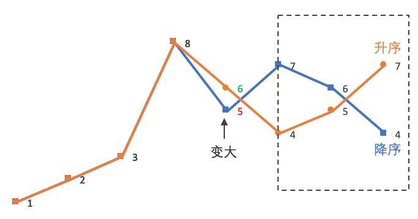

> 2025.2.9

## 二分查找

---

下面给出一般形式的二分查找：

```python
def bin_search(nums, target):
    l, r = 0, len(nums) - 1
    while l <= r: # == 不可删去，初始状态可能为 l == r；或者假设 r 处满足，l 不断逼近刚刚靠近 r ...
        mid = l + (r - l) // 2
        if nums[mid] == target:
            return mid
        elif nums[mid] < target:
            l = mid + 1
        else:
            r = mid - 1
    return -1
```

扩展可以得到下面函数：

```python
def lower_bound(nums, target):
    l, r = 0, len(nums) - 1
    while l <= r:
        mid = l + (r - l) // 2
        if nums[mid] < target:
            l = mid + 1
        else: # include nums[mid] == target
            r = mid - 1
    return l
```

`lower_bound` 函数结束时，`l`，`r`指针满足 `r = l + 1` and `nums[r] < target < nums[l]`

`lower_bound` 函数可拓展为：

```python
'''
    二分查找第一个满足条件的元素，如果没有满足条件的元素，返回插入位置
    satisfy: 判断条件的函数
'''
def lower_bound_general(nums, satisfy):
    l, r = 0, len(nums) - 1
    while l <= r:
        mid = l + (r - l) // 2
        if not satisfy(nums[mid]):
            l = mid + 1
        else:
            r = mid - 1
    return l

def lower_bound_general(nums, satisfy):
    l, r = 0, len(nums) - 1
    while l <= r:
        mid = l + (r - l) // 2
        if satisfy(nums[mid]):
            r = mid - 1
        else:
            l = mid + 1
    return l
```

关键在于，假设数组分为两部分，**满足条件的右侧，和不满足条件的左侧**

如果在 `l == r` 时停止循环，`l == r` 可能在分界线左，也可能在分解线右。因此再循环一次，这将导致`r`，`l`交错，且**分界线在两者之间**

当然也可以**三分**，三分时就是`bin_search`了

python库中也有二分查找module： https://docs.python.org/3/library/bisect.html

### [35. 搜索插入位置](https://leetcode.cn/problems/search-insert-position/)

若存在返回下标，否则返回插入位置

```python
class Solution:
    def searchInsert(self, nums: List[int], target: int) -> int:
        l, r = 0, len(nums) - 1
        while l <= r: 
            mid = l + (r - l) // 2
            if nums[mid] == target:
                return mid
            elif nums[mid] < target:
                l = mid + 1
            else:
                r = mid - 1
        return l

```

### [74. 搜索二维矩阵](https://leetcode.cn/problems/search-a-2d-matrix/)

两次二分（或通过取模运算合并为一次二分）

```python
    def searchMatrix(self, matrix: List[List[int]], target: int) -> bool:
        # search row
        l = 0
        r = len(matrix) - 1
        while l <= r:
            mid = (l + r) // 2
            if matrix[mid][0] == target:
                return True
            elif matrix[mid][0] > target:
                r = mid - 1
            else:
                l = mid + 1
        row = matrix[r]
        # search num
        l = 0
        r = len(row) - 1
        while l <= r:
            mid = (l + r) // 2
            if row[mid] == target:
                return True
            elif row[mid] > target:
                r = mid - 1
            else:
                l = mid + 1
        return False
```

```python
    def searchMatrix(self, matrix: List[List[int]], target: int) -> bool:
        m, n = len(matrix), len(matrix[0])
        left, right = -1, m * n
        while left + 1 < right:
            mid = (left + right) // 2
            x = matrix[mid // n][mid % n]
            if x == target:
                return True
            if x < target:
                left = mid
            else:
                right = mid
        return False
```

### [34. 在排序数组中查找元素的第一个和最后一个位置](https://leetcode.cn/problems/find-first-and-last-position-of-element-in-sorted-array/)

1. 初始想法，先找到一个，然后向两边拓展

```python
    def searchRange(self, nums: List[int], target: int) -> List[int]:
        def findone():
            l = 0
            r = len(nums) - 1
            while l <= r:
                mid = (l + r) // 2
                if nums[mid] == target:
                    return mid
                elif nums[mid] < target:
                    l = l + 1
                else:
                    r = r - 1
            return -1
        pos = findone()
        if pos == -1:
            return [-1, -1]
        l, r = pos, pos 
        while l - 1 >= 0 and nums[l - 1] == target:
            l = l - 1
        while r + 1 < len(nums) and nums[r + 1] == target:
            r = r + 1
        return [l, r]
```

2. 但其实不必如此

```python
class Solution:
    def lower_bound(self, nums: List[int], target: int) -> int:
        left, right = 0, len(nums) - 1 
        while left <= right:
            mid = (left + right) // 2
            if nums[mid] >= target:
                right = mid - 1
            else:
                left = mid + 1 
        return left

    def searchRange(self, nums: List[int], target: int) -> List[int]:
        start = self.lower_bound(nums, target)
        if start == len(nums) or nums[start] != target:
            return [-1, -1]
        end = self.lower_bound(nums, target + 1) - 1
        return [start, end]
```


### [33. 搜索旋转排序数组](https://leetcode.cn/problems/search-in-rotated-sorted-array/)

在传递给函数之前，`nums` 在预先未知的某个下标 `k`（`0 <= k < nums.length`）上进行了 **旋转**，使数组变为 `[nums[k], nums[k+1], ..., nums[n-1], nums[0], nums[1], ..., nums[k-1]]`（下标 **从 0 开始** 计数）。例如， `[0,1,2,4,5,6,7]` 在下标 `3` 处经旋转后可能变为 `[4,5,6,7,0,1,2]` 。

给你 **旋转后** 的数组 `nums` 和一个整数 `target` ，如果 `nums` 中存在这个目标值 `target` ，则返回它的下标，否则返回 `-1` 。

```python
    def search(self, nums: List[int], target: int) -> int:
        # find rotate index
        l = 0
        r = len(nums) - 1
        while l <= r:
            mid = (l + r) // 2
            if nums[mid] < nums[0]:
                r = mid - 1
            else: # small
                l = mid + 1
        rotate = l
        l = 0
        r = len(nums) - 1
        while l <= r:
            mid = (l + r) // 2
            if nums[(mid + rotate) % len(nums)] == target:
                return (mid + rotate) % len(nums)
            elif nums[(mid + rotate) % len(nums)] > target:
                r = mid - 1
            else:
                l = mid + 1
        return -1
```


### [153. 寻找旋转排序数组中的最小值](https://leetcode.cn/problems/find-minimum-in-rotated-sorted-array/)

```python
    def findMin(self, nums: List[int]) -> int:
        l = 0
        r = len(nums) - 1
        while l <= r:
            mid = (l + r) // 2
            if nums[mid] < nums[0]:
                r = mid - 1
            else:
                l = mid + 1
        if l == len(nums):
            return nums[0]
        else:
            return nums[l]
```


### [4. 寻找两个正序数组的中位数](https://leetcode.cn/problems/median-of-two-sorted-arrays/)

本题就不是凡人能够驾驭的了

## 栈

### [20. 有效的括号](https://leetcode.cn/problems/valid-parentheses/)

```python
    def isValid(self, s: str) -> bool:
        matchs = {
            ')' :'(',
            '}' :'{',
            ']' :'[',
            '(' :'x',
            '{' :'x',
            '[' :'x',
        }
        stack = []
        for c in s:
            if len(stack) == 0:
                stack.append(c)
            elif stack[-1] == matchs[c]:
                stack.pop()
            else:
                stack.append(c)
        return len(stack) == 0
```


### [155. 最小栈](https://leetcode.cn/problems/min-stack/)

设计一个支持 `push` ，`pop` ，`top` 操作，并能在常数时间内检索到最小元素的栈。

一个stack，一个排序好的array即可

```python
class MinStack:

    def __init__(self):
        self.array = []
        self.stack = []

    def push(self, val: int) -> None:
        for i in range(len(self.array)):
            if self.array[i] > val:
                self.array.insert(i, val)
                break
        if len(self.stack) == len(self.array):
            self.array.append(val)
        self.stack.append(val)

    def pop(self) -> None:
        val = self.stack.pop()
        self.array.remove(val)
        
    def top(self) -> int:
        return self.stack[-1]

    def getMin(self) -> int:
        return self.array[0]
```

但其实有更简单的做法，每次保留最小元素即可：

```python
class MinStack:
    def __init__(self):
        self.stack = []
        self.min_stack = [math.inf]

    def push(self, x: int) -> None:
        self.stack.append(x)
        self.min_stack.append(min(x, self.min_stack[-1]))

    def pop(self) -> None:
        self.stack.pop()
        self.min_stack.pop()

    def top(self) -> int:
        return self.stack[-1]

    def getMin(self) -> int:
        return self.min_stack[-1]
```

### [394. 字符串解码](https://leetcode.cn/problems/decode-string/)

递归解码。用栈处理括号匹配问题。

```python
    def decodeString(self, s: str) -> str:
        res = ""
        i = 0
        while i < len(s):
            if s[i].isdigit():
                # num
                num = ""
                while s[i] != '[':
                    num += s[i]
                    i += 1
                # repeat
                i += 1
                inners = ""
                cl_sk = ['[']
                while len(cl_sk) != 0:
                    if s[i] == '[':
                        cl_sk.append('[')
                        inners += s[i]
                    elif s[i] == ']':
                        cl_sk.pop()
                        if len(cl_sk) != 0:
                            inners += s[i]
                    else:
                        inners += s[i]
                    i += 1 
                res += int(num) * self.decodeString(inners)
            else:
                res += s[i]
                i += 1
        return res
```


### [739. 每日温度](https://leetcode.cn/problems/daily-temperatures/)

下一次更高温度。单调栈。

```python
    def dailyTemperatures(self, temperatures: List[int]) -> List[int]:
        stk = []
        higher = [0 for _ in range(len(temperatures))]
        for i in range(len(temperatures)):
            while len(stk) != 0 and temperatures[stk[-1]] < temperatures[i]:
                idx = stk.pop()
                higher[idx] = i - idx
            stk.append(i)
        for i in stk:
            higher[i] = 0
        return higher
```


### [84. 柱状图中最大的矩形](https://leetcode.cn/problems/largest-rectangle-in-histogram/)


暴力很容易想到。但单调栈的用法真是神来一笔。关键在于判断清楚什么时候需要计算一个矩形的面积。

```python
class Solution:
    def largestRectangleArea(self, heights: List[int]) -> int:
        stack = []
        heights = [0] + heights + [0]
        res = 0
        for i in range(len(heights)):
            while stack and heights[stack[-1]] > heights[i]:
                tmp = stack.pop()
                res = max(res, (i - stack[-1] - 1) * heights[tmp])
            stack.append(i)
        return res
```


## 堆

首先，堆实现如下：

```python
class MinHeap:
    def __init__(self, arr=None):
        if arr is None:
            self.heap = []
        else:
            self.heap = arr
            self._heapify()

    def _left(self, i):
        return 2 * i + 1

    def _right(self, i):
        return 2 * i + 2

    def _parent(self, i):
        return (i - 1) // 2

    def _swap(self, i, j):
        self.heap[i], self.heap[j] = self.heap[j], self.heap[i]

    def _heapify_down(self, i):
        left, right = self._left(i), self._right(i)
        smallest = i
        if left < len(self.heap) and self.heap[left] < self.heap[smallest]:
            smallest = left
        if right < len(self.heap) and self.heap[right] < self.heap[smallest]:
            smallest = right
        if smallest != i:
            self._swap(i, smallest)
            self._heapify_down(smallest)

    def _heapify(self):
        for i in range(len(self.heap) // 2 - 1, -1, -1):
            self._heapify_down(i)

    def push(self, item):
        self.heap.append(item)
        i = len(self.heap) - 1
        while i > 0 and self.heap[self._parent(i)] > self.heap[i]:
            self._swap(i, self._parent(i))
            i = self._parent(i)

    def pop(self):
        if not self.heap:
            return None
        if len(self.heap) == 1:
            return self.heap.pop()
        root = self.heap[0]
        self.heap[0] = self.heap.pop()
        self._heapify_down(0)
        return root

    def peek(self):
        return self.heap[0] if self.heap else None

```


### [215. 数组中的第K个最大元素](https://leetcode.cn/problems/kth-largest-element-in-an-array/)

基本快排：

```python
class Solution:
    def findKthLargest(self, nums, k):
        def quickselect(l, r):
            def partition(piv_idx):
                nums[r], nums[piv_idx] = nums[piv_idx], nums[r]
                lt = l
                for i in range(l, r):
                    if nums[i] > nums[r]:
                        nums[lt], nums[i] = nums[i], nums[lt]
                        lt += 1
                nums[r], nums[lt] = nums[lt], nums[r]
                return lt

            piv_idx = partition(random.randint(l, r))

            if piv_idx == k - 1:
                return nums[piv_idx]
            elif k <= piv_idx:
                return quickselect(l, piv_idx - 1)
            else:
                return quickselect(piv_idx + 1, r)

        return quickselect(0, len(nums) - 1)
```

快速选择。（**采取三路划分，处理大量重复元素的情况**）

```python
class Solution:
    def findKthLargest(self, nums, k):
        def quickselect(l, r):
            def three_way_partition(piv_idx):
                nums[r], nums[piv_idx] = nums[piv_idx], nums[r]
                pivot = nums[r]
                i = l
                lt = l
                gt = r
                while i < gt:
                    if nums[i] > pivot:
                        nums[i], nums[lt] = nums[lt], nums[i]
                        i += 1
                        lt += 1
                    elif nums[i] < pivot:
                        gt -= 1
                        nums[i], nums[gt] = nums[gt], nums[i]
                    else:
                        i += 1
                nums[gt], nums[r] = nums[r], nums[gt]
                return lt, gt

            piv_idx = random.randint(l, r)
            lt, gt = three_way_partition(piv_idx)
            if lt <= k - 1 <= gt:
                return nums[lt]
            elif k - 1 < lt:
                return quickselect(l, lt - 1)
            else:
                return quickselect(gt + 1, r)

        return quickselect(0, len(nums) - 1)
```


```python
def findKthLargest(nums, k):
    def quickSelect(left, right, k_smallest):
        if left == right:
            return nums[left]

        # 随机选择基准元素
        pivot_index = random.randint(left, right)
        pivot = nums[pivot_index]

        # 初始化三个指针
        lt = left  # 小于基准元素的区域的右边界
        gt = right  # 大于基准元素的区域的左边界
        i = left  # 当前遍历的元素的索引

        while i <= gt:
            if nums[i] < pivot:
                # 将小于基准的元素交换到左边
                nums[lt], nums[i] = nums[i], nums[lt]
                lt += 1
                i += 1
            elif nums[i] > pivot:
                # 将大于基准的元素交换到右边
                nums[i], nums[gt] = nums[gt], nums[i]
                gt -= 1
            else:
                # 等于基准的元素保持在中间
                i += 1

        # 根据 k_smallest 与小于、等于基准元素区域的位置关系继续查找
        if k_smallest < lt:
            return quickSelect(left, lt - 1, k_smallest)
        elif k_smallest <= gt:
            return nums[k_smallest]
        else:
            return quickSelect(gt + 1, right, k_smallest)

    # 第 k 大的元素就是第 n - k 小的元素
    return quickSelect(0, len(nums) - 1, len(nums) - k)
```


同时也有简单的非原地实现：

```python
class Solution:
    def findKthLargest(self, nums, k):
        def quick_select(nums, k):
            # 随机选择基准数
            pivot = random.choice(nums)
            big, equal, small = [], [], []
            # 将大于、小于、等于 pivot 的元素划分至 big, small, equal 中
            for num in nums:
                if num > pivot:
                    big.append(num)
                elif num < pivot:
                    small.append(num)
                else:
                    equal.append(num)
            if k <= len(big):
                # 第 k 大元素在 big 中，递归划分
                return quick_select(big, k)
            if len(nums) - len(small) < k:
                # 第 k 大元素在 small 中，递归划分
                return quick_select(small, k - len(nums) + len(small))
            # 第 k 大元素在 equal 中，直接返回 pivot
            return pivot
        
        return quick_select(nums, k)
```

或者使用最小堆：

```python
def findKthLargest(nums, k):
    # 创建一个最小堆，只维护 k 个最大的元素
    heap = []
    for num in nums:
        heapq.heappush(heap, num)
        if len(heap) > k:
            heapq.heappop(heap)
    return heap[0]
```


### [347. 前 K 个高频元素](https://leetcode.cn/problems/top-k-frequent-elements/)

实现一个堆即可

```python
class Solution:
    def topKFrequent(self, nums: List[int], k: int) -> List[int]:
        kk = k # alert!!!!
        freq = {}
        for n in nums:
            if not n in freq:
                freq[n] = 0
            freq[n] += 1
        rev = {}
        for k, v in freq.items():
            if not v in rev:
                rev[v] = []
            rev[v].append(k)

        freqs = list(freq.values()) 
        # parent of k = (k - 1) / 2
        # left son = 2k + 1; right son = 2k + 2
        def heapfy(hp: List[int], i: int):
            cur = i
            while True:
                ls = 2 * cur + 1
                rs = 2 * cur + 2
                if ls >= len(hp):
                    break
                if rs >= len(hp):
                    if hp[ls] > hp[cur]:
                        hp[ls], hp[cur] = hp[cur], hp[ls]
                        cur = ls
                        continue
                else:
                    son = ls
                    maxv = hp[ls]
                    if hp[rs] > hp[ls]:
                        son = rs
                        maxv = hp[rs] 
                    else:
                        son = ls
                        maxv = hp[ls] 
                    if maxv > hp[cur]:
                        hp[son], hp[cur] = hp[cur], hp[son]
                        cur = son
                        continue
                break
        def build_heap(hp: List[int]):
            for i in reversed(range(0, int(len(hp) / 2))):
                heapfy(hp, i)
        def pop(hp: List[int]) -> int:
            hp[0], hp[len(hp) - 1] = hp[len(hp) - 1] , hp[0]
            ret = hp.pop()
            heapfy(hp, 0)
            return ret

        build_heap(freqs)

        res = []
        for _ in range(kk):
            freq = pop(freqs)
            ele = rev[freq].pop()
            res.append(ele)
        return res
```

优化为：

```python
import heapq
from collections import Counter
def topKFrequent(nums, k):
    # 统计每个元素的出现频率
    count = Counter(nums)
    # 初始化最小堆
    heap = []
    for num, freq in count.items():
        # 将元素及其频率加入堆中
        heapq.heappush(heap, (freq, num))
        if len(heap) > k:
            # 当堆的大小超过 k 时，弹出堆顶元素
            heapq.heappop(heap)
    # 取出堆中的元素
    return [item[1] for item in heap]
```

排序也不会对复杂度影响太多：

```python
def topKFrequent(nums, k):
    # 统计每个元素的出现频率
    count = Counter(nums)
    # 按照频率从高到低排序
    sorted_items = sorted(count.items(), key=lambda item: item[1], reverse=True)
    # 取出前 k 个元素
    return [item[0] for item in sorted_items[:k]]
```

更优化的是桶排序：（频率范围已知）

```python
def topKFrequent(nums, k):
    # 统计每个元素的出现频率
    count = Counter(nums)
    # 创建桶，桶的索引表示频率，桶中存储对应频率的元素
    buckets = [[] for _ in range(len(nums) + 1)]
    for num, freq in count.items():
        buckets[freq].append(num)
    # 从频率高的桶开始取出元素
    result = []
    for i in range(len(buckets) - 1, -1, -1):
        if buckets[i]:
            result.extend(buckets[i])
            if len(result) >= k:
                break
    return result[:k]
```


### [295. 数据流的中位数](https://leetcode.cn/problems/find-median-from-data-stream/)

维护两个堆即可

```python

class MedianFinder:

    def __init__(self):
        self.min_heap = []
        self.max_heap = []        

    def addNum(self, num: int) -> None:
        if len(self.min_heap) == 0 or self.min_heap[0] < num:
            heapq.heappush(self.min_heap, num)
        else:
            heapq.heappush(self.max_heap, -num)
        while len(self.min_heap) < len(self.max_heap):
            maxh = -self.max_heap[0]
            heapq.heappop(self.max_heap)
            heapq.heappush(self.min_heap, maxh)
        while len(self.min_heap) > len(self.max_heap) + 1:
            minh = self.min_heap[0]
            heapq.heappop(self.min_heap)
            heapq.heappush(self.max_heap, -minh)

    def findMedian(self) -> float:
        if len(self.max_heap) == len(self.min_heap):
            return (self.min_heap[0] - self.max_heap[0])/ 2
        else:
            return self.min_heap[0]
```

## 贪心

### [121. 买卖股票的最佳时机](https://leetcode.cn/problems/best-time-to-buy-and-sell-stock/)

> 给定一个数组 `prices` ，它的第 `i` 个元素 `prices[i]` 表示一支给定股票第 `i` 天的价格。
>
> 你只能选择 **某一天** 买入这只股票，并选择在 **未来的某一个不同的日子** 卖出该股票。设计一个算法来计算你所能获取的最大利润。
>
> 返回你可以从这笔交易中获取的最大利润。如果你不能获取任何利润，返回 `0` 

就是求最大的两天差

```python
    def maxProfit(self, prices: List[int]) -> int:
        if prices == []:
            return 0
        min_p = prices[0]
        benifits = [0]
        for p in prices[1:]:
            min_p = min(min_p, p)
            benifits.append(p - min_p)
        return max(benifits)

```


### [55. 跳跃游戏](https://leetcode.cn/problems/jump-game/)

> 给你一个非负整数数组 `nums` ，你最初位于数组的 **第一个下标** 。数组中的每个元素代表你在该位置可以跳跃的最大长度。
>
> 判断你是否能够到达最后一个下标，如果可以，返回 `true` ；否则，返回 `false` 。

不断拓展farest指针...

```python
    def canJump(self, nums: List[int]) -> bool:
        farest = 0
        for i, step in enumerate(nums):
            if farest < i:
                return False
            farest = max(farest, i + step)
        return True
```


### [45. 跳跃游戏 II](https://leetcode.cn/problems/jump-game-ii/)

> 给定一个长度为 `n` 的 **0 索引**整数数组 `nums`。初始位置为 `nums[0]`。
>
> 每个元素 `nums[i]` 表示从索引 `i` 向后跳转的最大长度。换句话说，如果你在 `nums[i]` 处，你可以跳转到任意 `nums[i + j]` 处:
>
> - `0 <= j <= nums[i]` 
> - `i + j < n`
>
> 返回到达 `nums[n - 1]` 的最小跳跃次数。生成的测试用例可以到达 `nums[n - 1]`。

遍历数组时不断更新到达每个位置的最小跳数即可

也可以...

```python
    def jump(self, nums: List[int]) -> int:
        if len(nums) == 1:
            return 0
        cur = 0
        farest = nums[0]
        step = 1
        while True:
            if farest >= len(nums) - 1:
                return step
            for i in range(cur, farest + 1):
                if i + nums[i] > farest:
                    cur = i
                    farest = i + nums[i] 
            step += 1
```


### [763. 划分字母区间](https://leetcode.cn/problems/partition-labels/)

> 给你一个字符串 `s` 。我们要把这个字符串划分为尽可能多的片段，同一字母最多出现在一个片段中。
>
> 注意，划分结果需要满足：将所有划分结果按顺序连接，得到的字符串仍然是 `s` 。
>
> 返回一个表示每个字符串片段的长度的列表。

从第一个字母起不断拓展即可

```python
    def partitionLabels(self, s: str) -> List[int]:
        # smart! use a pre-compute table to avoid repeat computation
        last = {}
        for i, c in enumerate(s):
            last[c] = i
        res = []
        start = 0
        while start < len(s):
            end = last[s[start]]
            scan = start + 1
            while scan < end:
                end = max(last[s[scan]], end)
                scan += 1
            # res.append(s[start:end + 1])
            res.append(end - start + 1)
            start = end + 1
        return res
```


## 技巧

### [136. 只出现一次的数字](https://leetcode.cn/problems/single-number/)

> 给你一个 **非空** 整数数组 `nums` ，除了某个元素只出现一次以外，其余每个元素均出现两次。找出那个只出现了一次的元素。

异或

```python
    def singleNumber(self, nums: List[int]) -> int:
        return reduce(lambda x, y: x ^ y, nums)
```


### [169. 多数元素](https://leetcode.cn/problems/majority-element/)

> 给定一个大小为 `n` 的数组 `nums` ，返回其中的多数元素。多数元素是指在数组中出现次数 **大于** `⌊ n/2 ⌋` 的元素。
>
> 你可以假设数组是非空的，并且给定的数组总是存在多数元素。
>
> **进阶：**尝试设计时间复杂度为 O(n)、空间复杂度为 O(1) 的算法解决此问题。

一个非常神奇的算法——Boyer-Moore 投票算法

```python
    def majorityElement(self, nums: List[int]) -> int:
        count = 0
        candidate = None

        for num in nums:
            if count == 0:
                candidate = num
            count += (1 if num == candidate else -1)

        return candidate
```


### [75. 颜色分类](https://leetcode.cn/problems/sort-colors/)

> 给定一个包含红色、白色和蓝色、共 `n` 个元素的数组 `nums` ，**[原地](https://baike.baidu.com/item/原地算法)** 对它们进行排序，使得相同颜色的元素相邻，并按照红色、白色、蓝色顺序排列。
>
> 我们使用整数 `0`、 `1` 和 `2` 分别表示红色、白色和蓝色。
>
> - 你能想出一个仅使用常数空间的一趟扫描算法吗？


两次双指针

```python
    def sortColors(self, nums: List[int]) -> None:
        n = len(nums)
        ptr = 0
        for i in range(n):
            if nums[i] == 0:
                nums[i], nums[ptr] = nums[ptr], nums[i]
                ptr += 1
        for i in range(ptr, n):
            if nums[i] == 1:
                nums[i], nums[ptr] = nums[ptr], nums[i]
                ptr += 1
```

也可以直接分三路（下面的做法较为麻烦，不如从两边指针靠近）

```python
class Solution:
    def sortColors(self, nums: List[int]) -> None:
        n = len(nums)
        p0 = p1 = 0
        for i in range(n):
            if nums[i] == 1:
                nums[i], nums[p1] = nums[p1], nums[i]
                p1 += 1
            elif nums[i] == 0:
                nums[i], nums[p0] = nums[p0], nums[i]
                if p0 < p1:
                    nums[i], nums[p1] = nums[p1], nums[i]
                p0 += 1
```


### [31. 下一个排列](https://leetcode.cn/problems/next-permutation/)

> 整数数组的一个 **排列** 就是将其所有成员以序列或线性顺序排列。
>
> - 例如，`arr = [1,2,3]` ，以下这些都可以视作 `arr` 的排列：`[1,2,3]`、`[1,3,2]`、`[3,1,2]`、`[2,3,1]` 。
>
> 整数数组的 **下一个排列** 是指其整数的下一个字典序更大的排列。更正式地，如果数组的所有排列根据其字典顺序从小到大排列在一个容器中，那么数组的 **下一个排列** 就是在这个有序容器中排在它后面的那个排列。如果不存在下一个更大的排列，那么这个数组必须重排为字典序最小的排列（即，其元素按升序排列）。
>
> - 例如，`arr = [1,2,3]` 的下一个排列是 `[1,3,2]` 。
> - 类似地，`arr = [2,3,1]` 的下一个排列是 `[3,1,2]` 。
> - 而 `arr = [3,2,1]` 的下一个排列是 `[1,2,3]` ，因为 `[3,2,1]` 不存在一个字典序更大的排列。
>
> 给你一个整数数组 `nums` ，找出 `nums` 的下一个排列。
>
> 必须**[ 原地 ](https://baike.baidu.com/item/原地算法)**修改，只允许使用额外常数空间。

画图搞清楚意思：



```python
    def nextPermutation(self, nums: List[int]) -> None:
        i = len(nums) - 2
        # 寻找第一对逆序
        while i >= 0 and nums[i] >= nums[i + 1]:
            i -= 1
        # 找第一个比nums[i]大的nums[j]（最小的）
        if i >= 0:
            j = len(nums) - 1
            while j >= 0 and nums[i] >= nums[j]:
                j -= 1
            nums[i], nums[j] = nums[j], nums[i]
        
        # 顺序变换
        left, right = i + 1, len(nums) - 1
        while left < right:
            nums[left], nums[right] = nums[right], nums[left]
            left += 1
            right -= 1
```


### [287. 寻找重复数](https://leetcode.cn/problems/find-the-duplicate-number/)

> 给定一个包含 `n + 1` 个整数的数组 `nums` ，其数字都在 `[1, n]` 范围内（包括 `1` 和 `n`），可知至少存在一个重复的整数。
>
> 假设 `nums` 只有 **一个重复的整数** ，返回 **这个重复的数** 。
>
> 你设计的解决方案必须 **不修改** 数组 `nums` 且只用常量级 `O(1)` 的额外空间。
>
> 进阶`O(n)时间`

出了这题就等着挂吧x

提示：转化为快慢指针判断是否有环

```python
    def findDuplicate(self, nums: List[int]) -> int:
        slow = 0
        fast = 0

        while True:
            # fast 前进两次，slow 前进一次
            fast = nums[fast]
            fast = nums[fast]
            slow = nums[slow]
            if slow == fast:
                break

        # ptr == slow 时说明检测到重复元素，两个重复元素同时指向环的入口。
        ptr = 0
        while ptr != slow:
            ptr = nums[ptr]
            slow = nums[slow]

        return ptr
```

