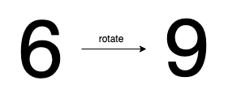

## 数组/字符串

### [624. 数组列表中的最大距离](https://leetcode.cn/problems/maximum-distance-in-arrays/)

```python
class Solution:
    def maxDistance(self, arrays: List[List[int]]) -> int:
        ans = 0
        mn, mx = inf, -inf
        for a in arrays:
            ans = max(ans, a[-1] - mn, mx - a[0])
            mn = min(mn, a[0])
            mx = max(mx, a[-1])
        return ans
```

可以用递推的思路理解

### [280. 摆动排序](https://leetcode.cn/problems/wiggle-sort/)

给你一个的整数数组 `nums`, 将该数组重新排序后使 `nums[0] <= nums[1] >= nums[2] <= nums[3]...` 

输入数组总是有一个有效的答案。

**示例 1:**

```
输入：nums = [3,5,2,1,6,4]
输出：[3,5,1,6,2,4]
解释：[1,6,2,5,3,4]也是有效的答案
```

**示例 2:**

```
输入：nums = [6,6,5,6,3,8]
输出：[6,6,5,6,3,8]
```

**提示：**

- `1 <= nums.length <= 5 * 104`
- `0 <= nums[i] <= 104`
- 输入的 `nums` 保证至少有一个答案。

 

**进阶：**你能在 `O(n)` 时间复杂度下解决这个问题吗？

```python
class Solution:
    def wiggleSort(self, nums: List[int]) -> None:
        nums.sort()
        for i in range(1, len(nums) - 1, 2):
            nums[i], nums[i + 1] = nums[i + 1], nums[i]
```

贪心做法（需要仔细观察过程）：

```python
class Solution:
    def wiggleSort(self, nums: List[int]) -> None:
        for i in range(len(nums) - 1):
            if ((i % 2 == 0 and nums[i] > nums[i + 1]) or 
                (i % 2 == 1 and nums[i] < nums[i + 1])):
                nums[i], nums[i + 1] = nums[i + 1], nums[i]

```


### [1056. 易混淆数](https://leetcode.cn/problems/confusing-number/)

给定一个数字 `N`，当它满足以下条件的时候返回 `true`：

原数字旋转 180° 以后可以得到新的数字。

如 0, 1, 6, 8, 9 旋转 180° 以后，得到了新的数字 0, 1, 9, 8, 6 。

2, 3, 4, 5, 7 旋转 180° 后，得到的**不是**数字。

易混淆数 (confusing number) 在旋转180°以后，可以得到和原来**不同**的数，且新数字的每一位都是有效的。

 

**示例 1：**



```
输入：6
输出：true
解释： 
把 6 旋转 180° 以后得到 9，9 是有效数字且 9!=6 。
```

**示例 2：**


```
输入：89
输出：true
解释: 
把 89 旋转 180° 以后得到 68，68 是有效数字且 89!=68 。
```

**示例 3：**


```
输入：11
输出：false
解释：
把 11 旋转 180° 以后得到 11，11 是有效数字但是值保持不变，所以 11 不是易混淆数字。 
```

**示例 4：**


```
输入：25
输出：false
解释：
把 25 旋转 180° 以后得到的不是数字。
```

**提示：**

1. `0 <= N <= 10^9`
2. 可以忽略掉旋转后得到的前导零，例如，如果我们旋转后得到 `0008` 那么该数字就是 `8` 。'

翻转是旋转的意思！！！

```python
class Solution:
    def confusingNumber(self, n: int) -> bool:
        num = []
        num_map = {'6': '9', '9': '6'}
        for i in str(n):
            if int(i) in [6, 9]:
                num.append(num_map[i])
            elif int(i) in [2, 3, 4, 5, 7]:
                return False
            else:
                num.append(i)
        if int("".join(reversed(num))) == n:
            return False
        return True
```

### [1427. 字符串的左右移](https://leetcode.cn/problems/perform-string-shifts/)

### [161. 相隔为 1 的编辑距离](https://leetcode.cn/problems/one-edit-distance/)

### [186. 反转字符串中的单词 II](https://leetcode.cn/problems/reverse-words-in-a-string-ii/)

### [1055. 形成字符串的最短路径](https://leetcode.cn/problems/shortest-way-to-form-string/)

## 滑动窗口

##  哈希

